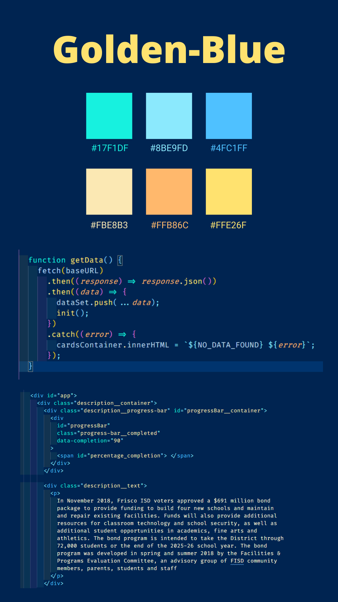

# Dark blue theme for VS Code

Dark blue VScode color theme from Bruno-DaSilva.com based on Tomorrow night's blue

### For more information

- [Visual Studio Code's Markdown Support](http://code.visualstudio.com/docs/languages/markdown)
- [Markdown Syntax Reference](https://help.github.com/articles/markdown-basics/)

**Enjoy!**
